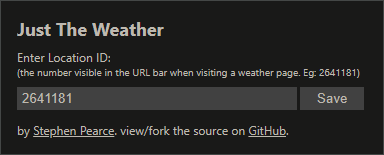

# Just The Weather

Favour the weather instead of the news and sport on bbc.co.uk.

This extension redirects visits to the homepage, news, and sport sections to the weather. If a weather location ID is provided, you'll be taken straight to your favourite weather location.

With all the bad news out there, this extension is intended to help break the habit of checking it.

Consider this a proof-of-concept extension. With more features and flexibility, it may make its way to the extension stores someday. For now, you can install it by enabling "Developer mode" in your browser extensions panel and loading the extension in "unpacked" mode.

The extension was developed on and is intended for Chromium-based web browsers.
